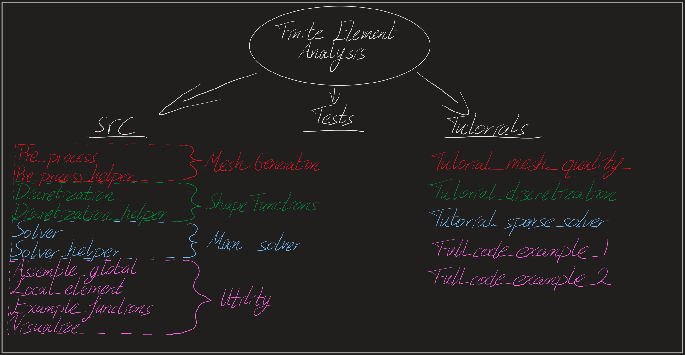
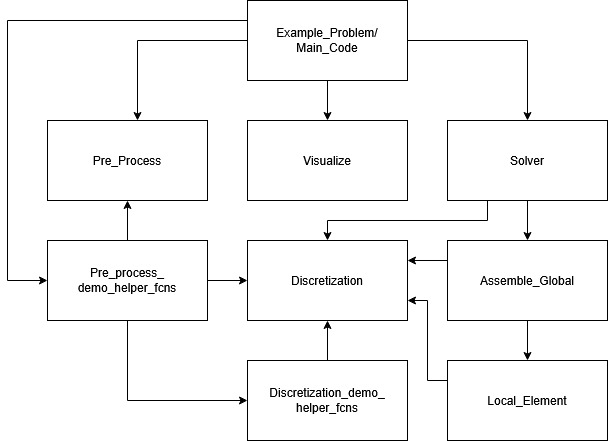

# Assignment # 3.4 High-level Overview and Tutorial of FEA Files and Functions
This assignment focuses on providing an in-depth, high-level overview of the Finite Element Analysis files, functions, concepts, and overall code. The beginning of this tutorial will go through the basics on downloading the files and creating a virtual conda environment to ensure everything runs smoothly. Once this first step is complete, this README will dive into how to use the code properly. 

Assignment 3 part 4 contains many different files and folders. Most noteable of them are described below:

- `README.md`: This file, containing instructions.
- `src folder`: Contains the main code for FEA tools such as discretization.
- `tests folder`: Contains the test functions to be used with Pytest.
- `tutorials folder`: Jupyter notebooks containing strictly code guides, python tutorial files on how to import and utilize the code, and graphic outputs from the tutorials.
- `genAIuse.txt`: Contains the statement describing how AI was used for this assignment.
- `pyproject.toml`: Contains all the requirements for getting the library setup.

## Getting Started
When cloning this repo, you will have a general `src` (source) folder with all the required files within it. `README.md` and `pyproject.toml` will be in the base directory next to the `src` folder. `Tutorials` folder will be our primary focus which will have sections that will peer into the other parts. The rest of the setup for this should be fairly straightforward.

We are going to create a new conda environment for this code. The reason being it is easier to keep track of all dependencies for how this runs within that conda environment. That way if you need to adjust something on your machine in the future, these installed packages will not mess with anything.

If you do not have conda installed on your computer, I will have a generic conda installation tutorial in the future. For now, please follow the commands below to create your conda environment.

### Conda Environment Setup

Begin by setting up a conda or mamba environment:
```bash
conda create --name finite-element-analysis-env python=3.12.9
```
Once the environment has been created, activate it:

```bash
conda activate finite-element-analysis-env
```
Double check that python is version 3.12 in the environment:
```bash
python --version
```
Ensure that pip is using the most up to date version of setuptools:
```bash
pip install --upgrade pip setuptools wheel
```
If you have a folder from which you are working from, please navigate there now. Otherwise, create a new folder to clone this repo and then navigate into it:
```bash
mkdir Finite-Element-Analysis
cd Finite-Element-Analysis
```
We need to git clone the original repo and then navigate to the FEA Part 3 sub-directory to install all the pre-requisites. In your terminal, please write the following:
```bash
git clone https://github.com/K-batonisashvili/Computational-Mechanics-Nonlinear-Systems.git
```
Once you clone the directory, lets navigate to the appropriate sub-directory. Your path should look similar to this:
```bash
cd ./Assignment-3/Part-4/finite-element-analysis
```
Finally, with this pip install command, we will download all required packages and dependencies into your conda environment:
```bash
pip install -e .
```
Thats it!

### TROUBLESHOOTING: If you encounter "finiteelementanalysis module not available"

If any of the code is running into issues and the errors which say "unable to find library", that might mean one of 2 things, please try both fixes.

1) Make sure your conda environment is activated in the terminal by doing conda activate finite-element-analysis-env. Then run the command `conda list` which should include the finiteelementanalysis library.
2) When running in VScode directly, please make sure that your interpreter for the Jupyter Notebook is running the conda environment instance. In VScode, press CTRL SHIFT P and type in "interpreter" and go through the menu to select your conda env.


## Tutorial Deep Dive

In this part of the README, we will heavily dive into the tutorial section of our Finite Element Analysis code, which will branch out to the remaining sections. If there is mention of images or plotted graphics and you do not see those in your directory, that would be because those graphics were not included in the github repo due to size limitations. Stepping through the tutorial files should generate those graphics.


### Folder & Code Structure




- visualize.py: This file contains functions for visualizing our analysis results with deformation plots, stress distributions, or animations.

- solver.py: This file implements the main solver function for our problems by finding node displacements.

- solver_demo_helper_functions.py: This file provides utility functions for the solver, such as constructing and visualizing the stiffness matrix.  It provides other modifications to this stiffness matrix that assist in computation.

- pre_process.py: This file contains functions for preprocessing finite element models, such as generating meshes, defining boundary conditions, and preparing input data for the solver. It specifically assist in generating tri and quad type meshes.

- pre_process_demo_helper_fcns.py: This file, similar to the demo_helper, provides helper functions for visualizing, debugging, plotting meshes or inspecting boundary conditions.

- local_element.py: This mathematically concentrated file assists in performing computations on element load through Jacobians and matrix analysis.

- example_functions.py: Test file that is not used in FEA.

- discretization.py: This file defines shape functions, gauss points, and face nodes for each different element type.

- discretization_demo_helper_fcns.py: This file, similar to others, provides utility type functions that assist with discretization, such as plotting, mathematical transformations, jacobian calculations, and more.

- assemble_global.py: This file assembles global matrices and vectors, such as the stiffness matrix and load vector. It helps convert from local to global.


The `tutorials` folder that we were originally working from contains several different examples on implementing these files. 

- tutorial_analytical_performance.ipynb: This tutorial file demonstrates how the computationally calculated displacement can be compared to the analytically derived one. This is meant as a way to check your solution and ensure you are getting the proper answers.

- tutorial_FEA_Failure.ipynb: This tutorial file is meant to provide examples on how to incorrectly initialize the FEA code which will result in either failures, incorrect solutions, runtime errors, and more.

- tutorial_p_&_h_refinement.ipynb: This tutorial file demonstrates the differences between p & h refinement, where one of the methods provides a correct solution to an extremely large deformation, whereas the other does not. 

The `tests` folder provides pytest files used specifically to analyze the correctness of the src folder. All tests should pass when running a pytest coverage command. 